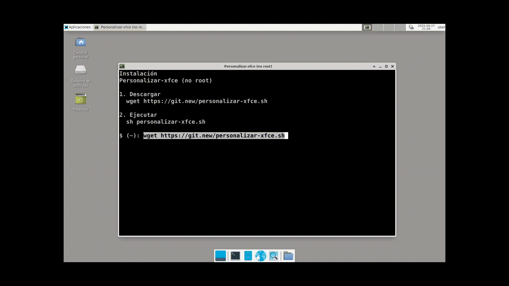

# Personalizar-xfce
[](LICENSE.md)

[](https://github.com/AlexGracia/Personalizar-xfce/tags)

Script que personaliza [Xfce](https://www.xfce.org/).

## Requisitos
- Conexión de red
- Paquete [wget](https://www.gnu.org/software/wget/)
- Paquete [p7zip-full](http://p7zip.sourceforge.net/)

## Demostración


## Instalación
1. Descargar
    ```sh
    wget https://git.new/personalizar-xfce.sh
    ```
1. Ejecutar
    ```sh
    sh personalizar-xfce.sh
    ```

## Herramientas
- [IT-TOOLS](https://github.com/CorentinTh/it-tools): [ASCII Art Text Generator](https://it-tools.tech/ascii-text-drawer), fuente ANSI Shadow, utilizado en texto de bienvenida y despedida.
- [Pollinations.AI](https://github.com/pollinations/pollinations): [generación de imagen con IA](https://pollinations.ai/), utilizado en fondos de pantalla.
- [Llama 3.3](https://github.com/meta-llama/llama3): utilizado a través del chat de [DuckDuckGo](https://Duck.ai), para resolver dudas.
- [Dub](https://github.com/dubinc/dub): [acortador de enlaces](https://dub.co/), utilizado en el enlace de descarga.
- [Nano](https://www.nano-editor.org/git.php): [editor de texto](https://www.nano-editor.org/docs.php).
